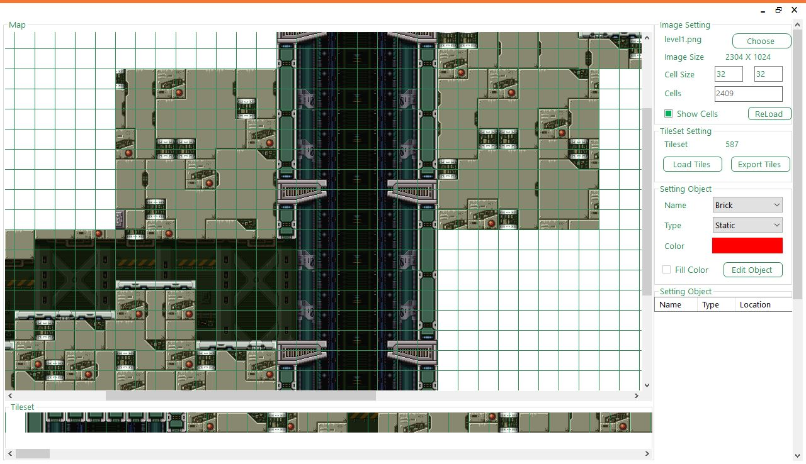
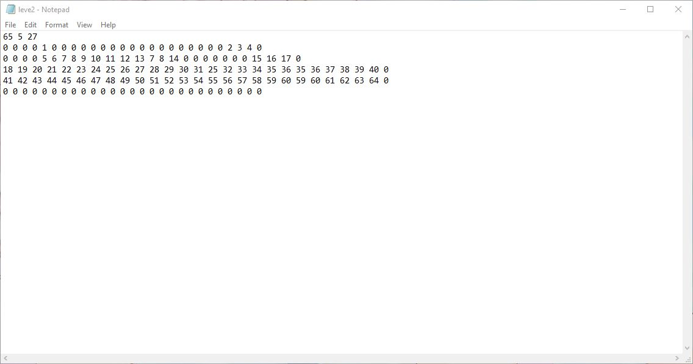
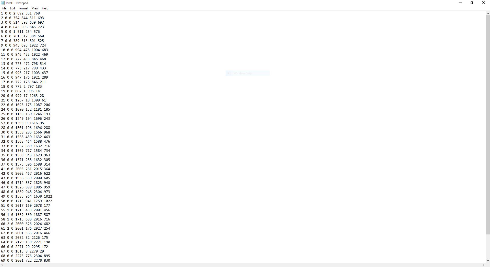
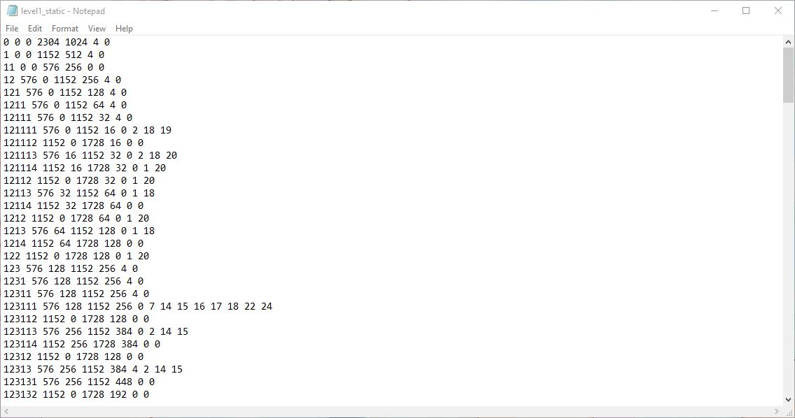

# MapEditor For Game C++ Directx - UIT
MapEditor Cho Nhập Môn Phát Triển Game

## 📑 Contents
* [Features](#-features)
* [Installation](#-installation)
* [Documents](#-documents)
* [Build with](#-build-with)
* [Some Screens](#-some-screens)
* [Bugs and Issues](#-bugs-and-issues)
* [Authors](#-authors)
* [License](#-license)
## 📌 Features
* [Load image](#map)
* [Cut tiles](#Map-Tile)
* [Export tiles to file txt](#Map-encode)
* [Add objects to map](#add-objects)
* [Export objects in map to file](#Object-file)
* [Build quatree and export to file](#Quadtree)
## ⚙️ Installation
* Build with visual studio. You can add reference
**Right click project** -> **Add** -> **Reference** -> **Choose Browse** -> **select all .dll in \MapEditor\Resources**
* [File Install](https://github.com/tvc12/MapEditor/releases/download/v1.0.0/Map.Editor.zip)
## 📖 Documents

## 🔧 Build with
* [C#](https://docs.microsoft.com/en-us/dotnet/csharp/)
* [Visual Studio 2017](https://visualstudio.microsoft.com/downloads/)

## 🖼️ Some Screens
### Map
### Map tile
### Map encode
### Add objects
### Object file
### Quadtree
## 🐛 Bugs and Issues
* Have a bug or an issue with this project? [Open a new issue](https://github.com/tvc12/MapEditor/issues/new) here on GitHub.
## 😸 Authors
* **Vi Chi Thien** - [tvc12](https://github.com/tvc12) 😸
## © License
* [MIT](LICENSE)  
